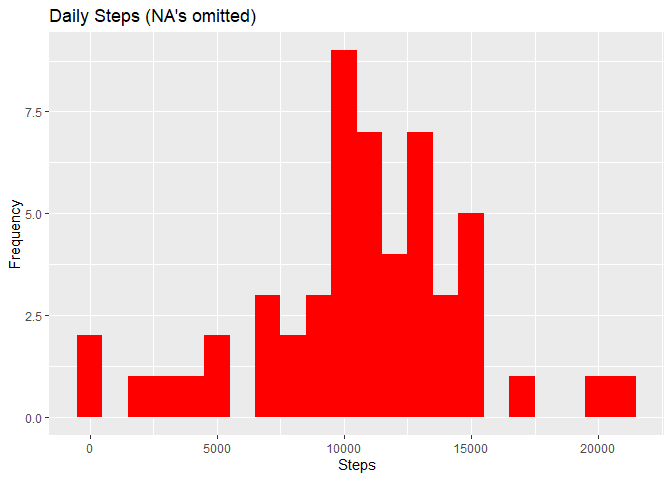
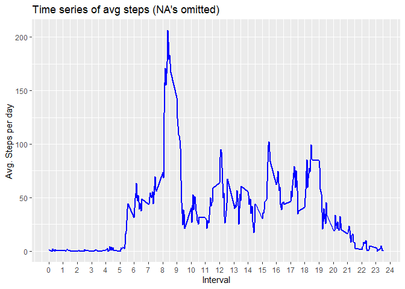
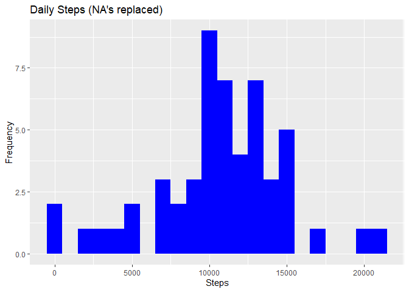
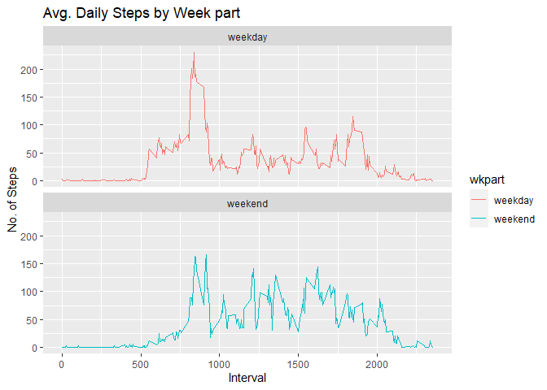

## 1. Loading and preprocessing the data


```r
library("data.table")
library(ggplot2)
fileUrl <- "https://d396qusza40orc.cloudfront.net/repdata%2Fdata%2Factivity.zip"
download.file(fileUrl, destfile = paste0(getwd(), '/activity.zip'), method = "curl")
#Unzip data to obtain a csv file
unzip("activity.zip")
#Reading csv Data into Data.Table
activityDT <- data.table::fread(input = "activity.csv")
```


## 2. What is mean total number of steps taken per day?

For this part of the assignment, you can ignore the missing values in the dataset.


```r
activityDT_no_NA  <-na.omit(activityDT)
```

### 2.1. Calculate the total number of steps taken per day


```r
Total_Steps <- activityDT_no_NA[, c(lapply(.SD, sum, na.rm = FALSE)), .SDcols = c("steps"), by = .(date)] 
head(Total_Steps,100)
```

```
##           date steps
##  1: 2012-10-02   126
##  2: 2012-10-03 11352
##  3: 2012-10-04 12116
##  4: 2012-10-05 13294
##  5: 2012-10-06 15420
##  6: 2012-10-07 11015
##  7: 2012-10-09 12811
##  8: 2012-10-10  9900
##  9: 2012-10-11 10304
## 10: 2012-10-12 17382
## 11: 2012-10-13 12426
## 12: 2012-10-14 15098
## 13: 2012-10-15 10139
## 14: 2012-10-16 15084
## 15: 2012-10-17 13452
## 16: 2012-10-18 10056
## 17: 2012-10-19 11829
## 18: 2012-10-20 10395
## 19: 2012-10-21  8821
## 20: 2012-10-22 13460
## 21: 2012-10-23  8918
## 22: 2012-10-24  8355
## 23: 2012-10-25  2492
## 24: 2012-10-26  6778
## 25: 2012-10-27 10119
## 26: 2012-10-28 11458
## 27: 2012-10-29  5018
## 28: 2012-10-30  9819
## 29: 2012-10-31 15414
## 30: 2012-11-02 10600
## 31: 2012-11-03 10571
## 32: 2012-11-05 10439
## 33: 2012-11-06  8334
## 34: 2012-11-07 12883
## 35: 2012-11-08  3219
## 36: 2012-11-11 12608
## 37: 2012-11-12 10765
## 38: 2012-11-13  7336
## 39: 2012-11-15    41
## 40: 2012-11-16  5441
## 41: 2012-11-17 14339
## 42: 2012-11-18 15110
## 43: 2012-11-19  8841
## 44: 2012-11-20  4472
## 45: 2012-11-21 12787
## 46: 2012-11-22 20427
## 47: 2012-11-23 21194
## 48: 2012-11-24 14478
## 49: 2012-11-25 11834
## 50: 2012-11-26 11162
## 51: 2012-11-27 13646
## 52: 2012-11-28 10183
## 53: 2012-11-29  7047
##           date steps
```

### 2.2. Make a histogram of the total number of steps taken each day


```r
ggplot(Total_Steps, aes(x = steps)) +
    geom_histogram(fill = "red", binwidth = 1000) +
    labs(title = "Daily Steps (NA's omitted)", x = "Steps", y = "Frequency")
```

<!-- -->

### 2.3. Calculate and report the mean and median of the total number of steps taken per day


```r
Total_Steps[, .(Mean_Steps_per_day = mean(steps, na.rm = TRUE), Median_Steps_per_day = median(steps, na.rm = TRUE))]
```

```
##    Mean_Steps_per_day Median_Steps_per_day
## 1:           10766.19                10765
```

## 3. What is the average daily activity pattern?

### 3.1. Make a time series plot of the 5-minute interval and the average number of steps taken, averaged across all days


```r
IntervalDT <- activityDT[, c(lapply(.SD, mean, na.rm = TRUE)), .SDcols = c("steps"), by = .(interval)] 
ggplot(IntervalDT, aes(x = interval , y = steps)) + geom_line(color="blue", size=1) + scale_x_continuous(breaks=seq(0,2400, by=100),label=c(0:24)) +
labs(title = "Time series of avg steps (NA's omitted)", x = "Interval", y = "Avg. Steps per day")
```

<!-- -->

### 3.2. Which 5-minute interval, on average across all the days in the dataset, contains the maximum number of steps?

```r
MaxInterval <- IntervalDT[steps == max(steps),]
cat("The 5-minute interval starting at",as.character(MaxInterval[1,1]/100),"am, on average across all the days, contains the maximum number of steps of", round(as.numeric(MaxInterval[1,2]),digits=2))
```

```
## The 5-minute interval starting at 8.35 am, on average across all the days, contains the maximum number of steps of 206.17
```

## 4. Imputing missing values

### 4.1. Calculate and report the total number of missing values in the dataset (i.e. the total number of rows with 𝙽𝙰s)


```r
cat("The total number of missing values in the dataset is:", activityDT[is.na(steps), .N ])
```

```
## The total number of missing values in the dataset is: 2304
```

### 4.2. Devise a strategy for filling in all of the missing values in the dataset

*My strategy is to replace missing values in the dataset with the corresponding mean for that 5-minute interval. The mean for each 5-minute interval was calculated above.*

### 4.3. Create a new dataset that is equal to the original dataset but with the missing data filled in


```r
newactivityDT <- activityDT 
        for (i in 1:nrow(newactivityDT)) {
                if (is.na(newactivityDT$steps[i])) {
                        newactivityDT$steps[i] <- IntervalDT[which(newactivityDT$interval[i] == IntervalDT$interval), ]$steps
                }
        }
```

### 4.4. Make a histogram of the total number of steps taken each day and Calculate and report the mean and median total number of steps taken per day

#### 4.4.1.Histogram of the total number of steps taken each day after replacing missing values in the dataset


```r
Total_Steps_NA_replaced <- newactivityDT[, c(lapply(.SD, sum, na.rm = FALSE)), .SDcols = c("steps"), by = .(date)] 
ggplot(Total_Steps, aes(x = steps)) +
    geom_histogram(fill = "blue", binwidth = 1000) +
    labs(title = "Daily Steps (NA's replaced)", x = "Steps", y = "Frequency")
```

<!-- -->

#### 4.4.2. Calculate and report the mean and median total number of steps taken per day after replacing missing values in the dataset

```r
Total_Steps_NA_replaced[, .(Mean_Steps_per_day_NA_replaced = mean(steps, na.rm = TRUE), Median_Steps_per_day_NA_replaced = median(steps, na.rm = TRUE))]
```

```
##    Mean_Steps_per_day_NA_replaced Median_Steps_per_day_NA_replaced
## 1:                       10766.19                         10766.19
```

####  4.4.3. Do these values differ from the estimates from the first part of the assignment? What is the impact of imputing missing data on the estimates of the total daily number of steps?

*The differences are presented below:*


```r
summary_mean_median<-data.frame(rbind(mean=c(mean(Total_Steps_NA_replaced$steps),mean(Total_Steps$steps),mean(Total_Steps_NA_replaced$steps)-mean(Total_Steps$steps)),median=c(median(Total_Steps_NA_replaced$steps),median(Total_Steps$steps),median(Total_Steps_NA_replaced$steps)-median(Total_Steps$steps))))
names(summary_mean_median)<-c("NA replaced","NA omited","difference")
summary_mean_median
```

```
##        NA replaced NA omited difference
## mean      10766.19  10766.19   0.000000
## median    10766.19  10765.00   1.188679
```

#### 4.4.4. What is the impact of imputing missing data on the estimates of the total daily number of steps?

*The means are virtually the same but there is a slight shift in the median*

## 5. Are there differences in activity patterns between weekdays and weekends?

### 5.1. Create a new factor variable in the dataset with two levels – “weekday” and “weekend” indicating whether a given date is a weekday or weekend day.


```r
newactivityDT$wkpart <- as.factor(ifelse(weekdays(newactivityDT$date,abbreviate=T) %in% c("Sat","Sun"),"weekend", "weekday"))
table(newactivityDT$wkpart)
```

```
## 
## weekday weekend 
##   12960    4608
```

```r
head(newactivityDT, 10)
```

```
##         steps       date interval  wkpart
##  1: 1.7169811 2012-10-01        0 weekday
##  2: 0.3396226 2012-10-01        5 weekday
##  3: 0.1320755 2012-10-01       10 weekday
##  4: 0.1509434 2012-10-01       15 weekday
##  5: 0.0754717 2012-10-01       20 weekday
##  6: 2.0943396 2012-10-01       25 weekday
##  7: 0.5283019 2012-10-01       30 weekday
##  8: 0.8679245 2012-10-01       35 weekday
##  9: 0.0000000 2012-10-01       40 weekday
## 10: 1.4716981 2012-10-01       45 weekday
```

### 5.2. Make a panel plot containing a time series plot of the 5-minute interval and the average number of steps taken, averaged across all weekday days or weekend days


```r
newactivityDT[is.na(steps), "steps"] <-newactivityDT[, c(lapply(.SD, median, na.rm = TRUE)), .SDcols = c("steps")]
IntervalDT <- newactivityDT[, c(lapply(.SD, mean, na.rm = TRUE)), .SDcols = c("steps"), by = .(interval, wkpart)] 

ggplot(IntervalDT , aes(x = interval , y = steps, color=`wkpart`)) + geom_line() + labs(title = "Avg. Daily Steps by Week part", x = "Interval", y = "No. of Steps") + facet_wrap(~`wkpart` , ncol = 1, nrow=2)
```

<!-- -->

* *In the morning intervals, there is a slight reduction of steps on weekends*
* *In the afternoun and evening intervals, there is a slight increase on weekends*
